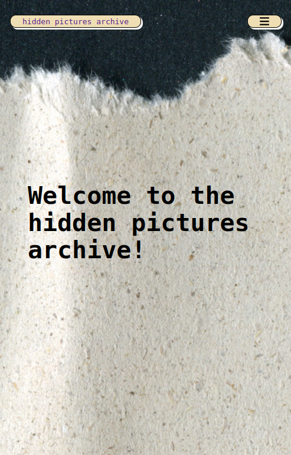
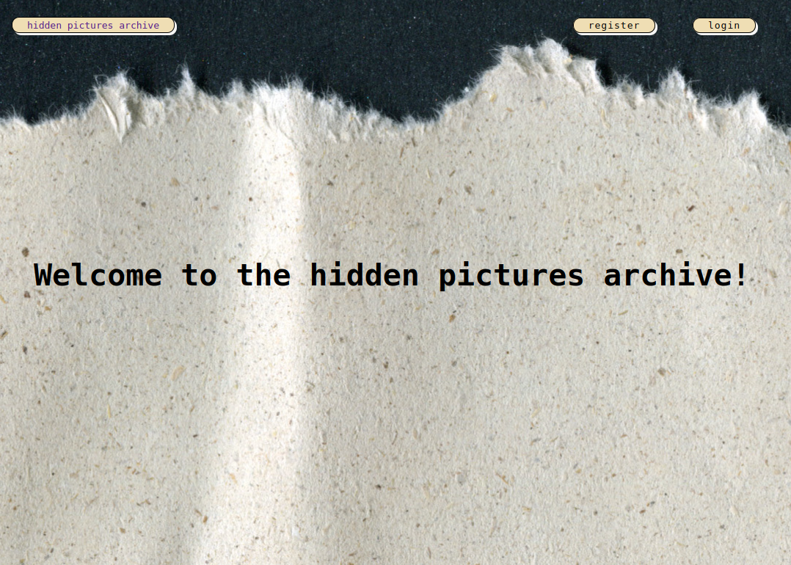
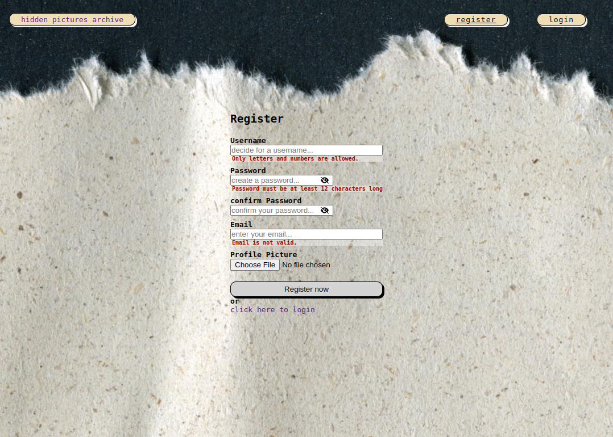
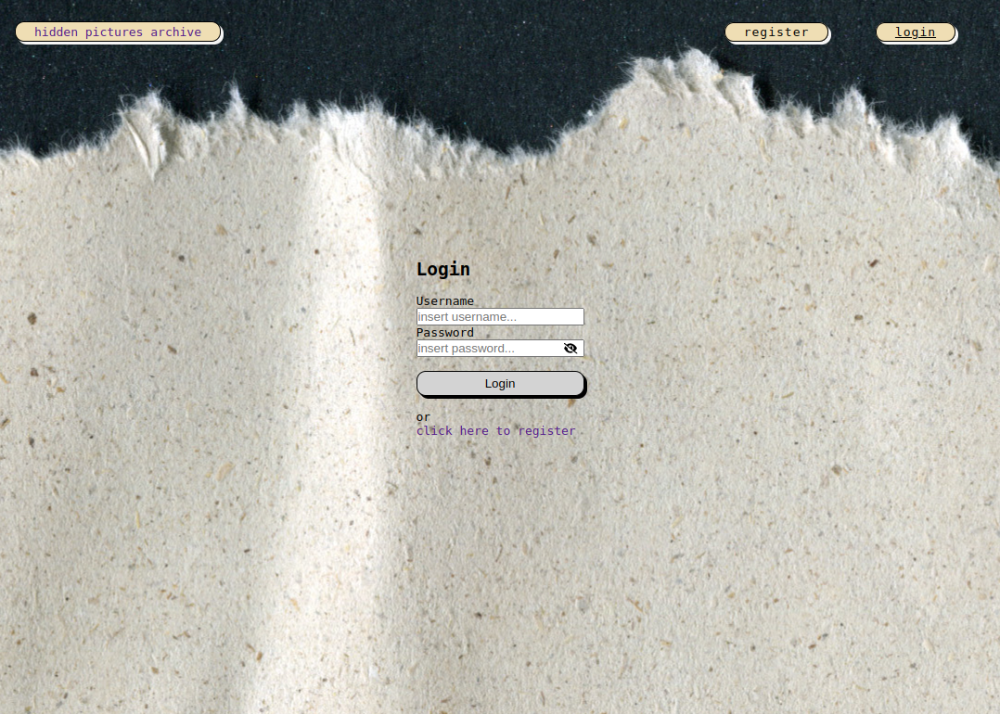
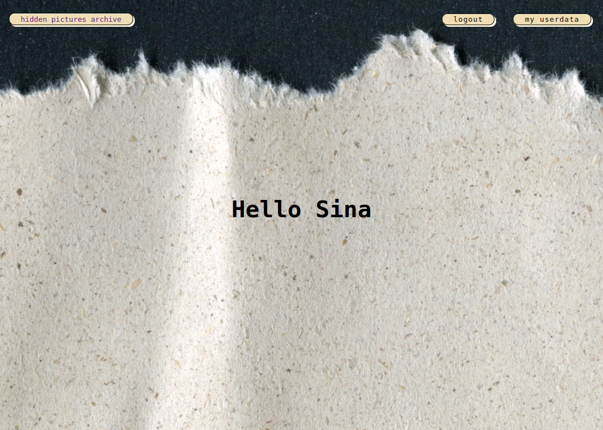
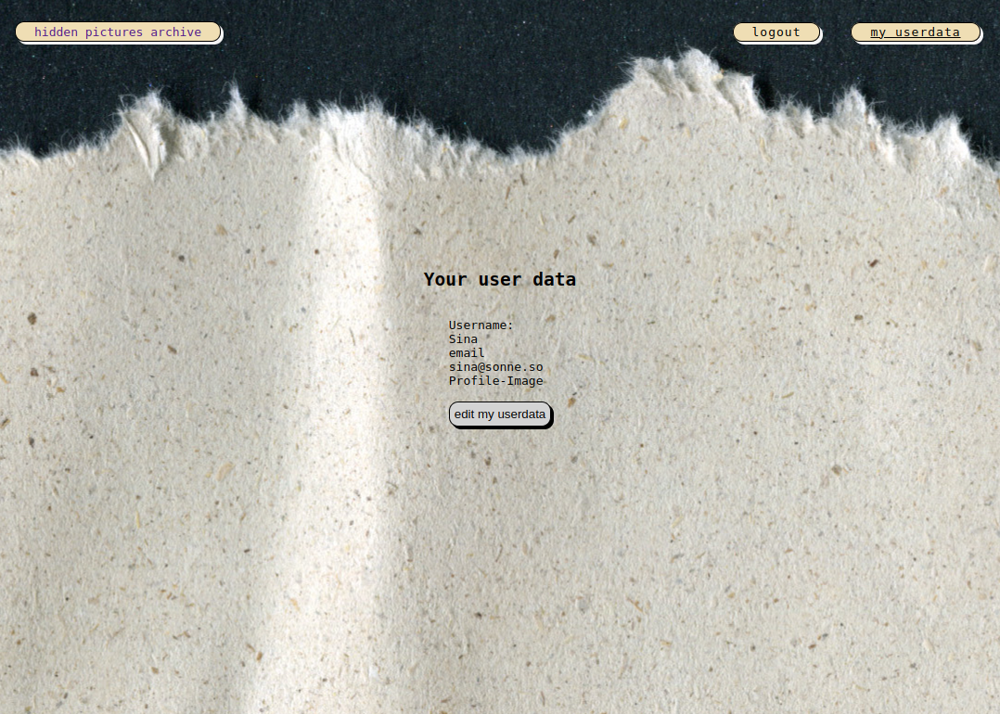
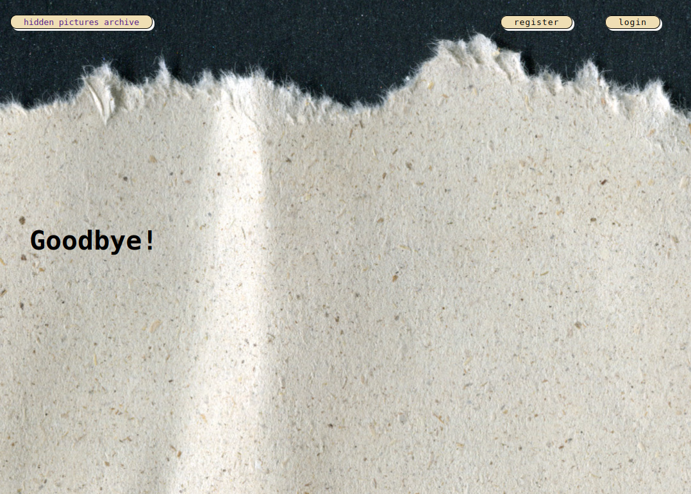

# hidden pictures archive

## Project Description

**hidden pictures archive** is a backend-focused project with an evolving frontend. The goal of this project is to allow users to create their own image collections from scanned or photographed images of old magazines or books after registering. Users can build a personalized digital image archive.

The backend is built using Node.js and Express, with data stored in a MongoDB database that I created myself. Images are stored on Cloudinary, with the image paths stored in the database, enabling seamless image storage within the application.

### Backend Features:

- User registration (including profile picture upload)
- User login
- Creating image collections
- Adding images to collections
- Basic CRUD operations for users, collections, and images

The backend incorporates the following technologies:

- **JSON Web Tokens (JWT):** Used for secure authentication and user session management.
- **bcrypt:** Used for securely hashing user passwords before storing them in the database.
- **Multer:** Handles file uploads, including user profile pictures and images for collections.
- **ClamAV (ClamScan):** Used for scanning uploaded images to ensure they are free of malware or viruses before being stored.

The frontend is currently under development using React.js and Vite.js, with ongoing work to complete the interface.

## Features

- **CRUD Operations:** Basic operations for retrieving, deleting, and updating users, collections, and images.
- **User Registration:** Allows users to create an account, including uploading a profile picture.
- **User Login:** Authentication system for secure access.
- **Image Collection Management:** Users can create and manage their image collections.

## Installation

To set up the project locally, follow these steps:

1. Clone the repository:
    ```bash
    git clone https://github.com/your-username/hiddenBookArchive.git
    ```

2. Navigate to the project directory:
    ```bash
    cd hiddenBookArchive
    ```

3. Install dependencies:
    ```bash
    npm install
    ```

4. Configure environment variables:
   - In both the `backend` and `frontend` directories, you will find `.env.example` files.
   - Copy the `.env.example` file to `.env` in each directory:
     ```bash
     cp backend/.env.example backend/.env
     cp frontend/.env.example frontend/.env
     ```
   - Open each `.env` file and add the required environment variables (e.g., database connection string, Cloudinary API keys).

5. Start the backend and frontend servers:
    ```bash
    npm run dev
    ```

## Usage

This project can be used to digitize and organize your own analog image archive, sourced from old books and/or magazines, into collections that are stored and managed digitally.

## Prerequisites

- A code editor (e.g., VSCode)
- A MongoDB database
- A Cloudinary account for image storage
- ClamAV installed for scanning uploaded images

## Contribution

Suggestions or improvements are welcome. Please feel free to reach out with your ideas or feedback.

## Contact

For any questions or support, feel free to contact me through my GitHub profile.

## Preview













